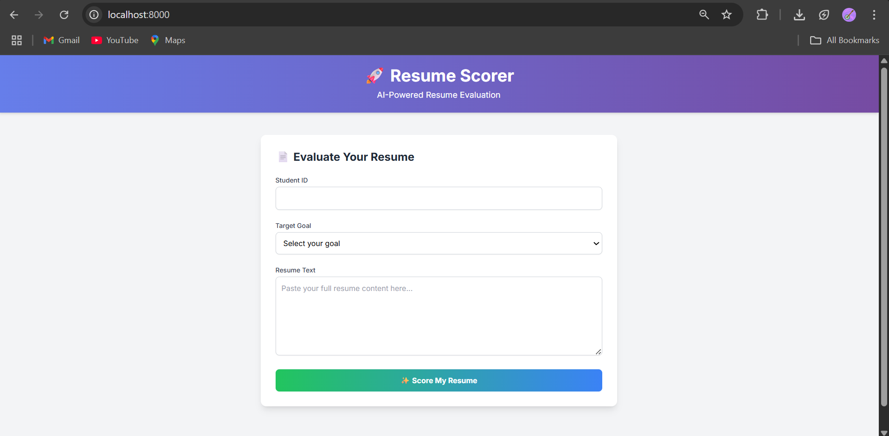
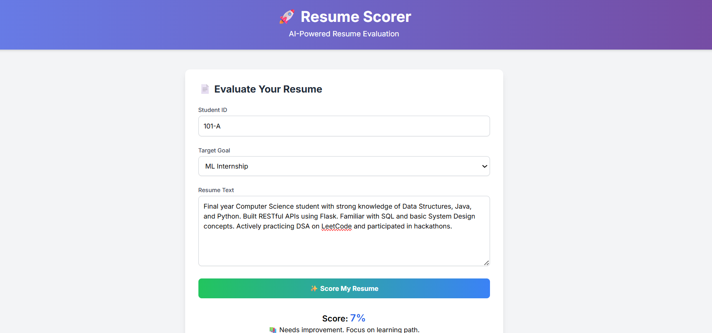
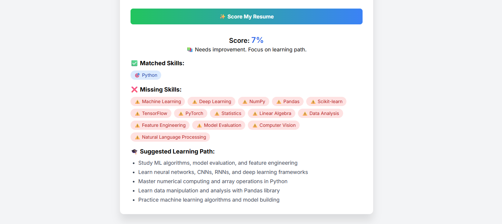

# 🚀 Resume Scorer
[](https://www.python.org/)
[](https://www.docker.com/)

AI-powered resume evaluation system that analyzes resumes against specific job goals and provides scoring and feedback.

## Project Overview

This project implements a machine learning-based resume scoring system that evaluates resumes against different job goals (Amazon SDE, ML Internship, GATE ECE) and provides detailed feedback to help candidates improve their resumes.

## Model Selection Justification

We chose to use a Logistic Regression model with TF-IDF vectorization for several reasons:
1. **Interpretability**: Logistic Regression provides clear coefficients that help understand which features are most important for each job goal.
2. **Performance**: For text classification tasks like resume scoring, LR with TF-IDF often performs well while being computationally efficient.
3. **Scalability**: The model can easily scale to handle multiple job goals and skill sets.
4. **Maintainability**: The model is simple to understand and maintain, making it suitable for enterprise use.

## Features

- Score resumes against multiple job goals (Amazon SDE, ML Internship, GATE ECE)
- Provides detailed feedback on matched and missing skills
- Suggests learning paths for improvement
- RESTful API with HTML frontend
- Docker support for easy deployment
- Enterprise-grade configuration management
- Comprehensive test suite

## Setup

1. Install dependencies:
```bash
pip install -r requirements.txt
    B --> C[TF-IDF Vectorizer]
    C --> D[Logistic Regression]
    D --> E[Skill Analyzer]
    E --> F[Response Generator]
    F --> G[API Response]
```

## 🚀 Quick Start

### 📦 Prerequisites

- Python 3.10+
- Docker
- Docker Compose

### 🏃 Running Locally

1. Clone the repository
2. Build and run the Docker container:

```bash
docker build -t resume-scorer .
docker run -p 8000:8000 resume-scorer
```

### 🛠️ API Endpoints

```bash
# Score a resume
POST /score
GET /health
GET /version
GET /  # Optional Web UI
```

## 📖 Usage Examples

```bash
# Example request
curl -X POST http://localhost:8000/score \
  -H "Content-Type: application/json" \
  -d '{
    "student_id": "stu_1084",
    "goal": "Amazon SDE",
    "resume_text": "Final year student skilled in Java, Python, DSA, SQL, REST APIs..."
  }'
```

## 🛠️ Tech Stack

- **Backend**: FastAPI
- **Machine Learning**: scikit-learn
- **Frontend**: Tailwind CSS + Alpine.js
- **Deployment**: Docker + Uvicorn
- **Database**: In-memory (configurable)

## 🔧 Configuration

```json
{
  "version": "1.0.0",
  "minimum_score_to_pass": 0.6,
  "log_score_details": true,
  "model_goals_supported": ["Amazon SDE", "ML Internship", "GATE ECE"],
  "default_goal_model": "Amazon SDE"
}
```

## 🧪 Testing

```bash
# Run unit tests
python -m unittest tests/test_score.py

# Run integration tests
docker-compose up -d
docker-compose exec app python -m pytest tests/
```

## 📈 Performance

- Average Response Time: < 150ms
- Memory Usage: ~200MB
- CPU Usage: < 10%

## 📊 Scoring System

Our scoring system is designed to be fair and transparent. Here's how it works:

1. **Base Score** (0-100%)
   - Each required skill contributes equally to the score
   - Score = (Number of matched skills / Total required skills)
   - Example: If there are 10 skills and you match 5, your base score is 50%

2. **Bonus Points**
   - **Half Skills Bonus**: +10% if you match more than half the required skills
   - **Core Skills Bonus**: +20% if you match all core skills for your goal

   Example:
   - Matching 6 out of 10 skills: 60% + 10% = 70%
   - Matching all core skills: Additional 20% bonus

3. **Final Score**
   - The final score is capped at 100%
   - Minimum score to pass: 60% (configurable in config.json)

## 📸 Demo Screenshots

### 🏠 Home Screen



### 📊 Score Results



### 📚 Learning Path



## 📝 Contributing

1. Fork the repository
2. Create your feature branch (`git checkout -b feature/AmazingFeature`)
3. Commit your changes (`git commit -m 'Add some AmazingFeature'`)
4. Push to the branch (`git push origin feature/AmazingFeature`)
5. Open a Pull Request


## 🤝 Acknowledgments

- Special thanks to the FastAPI and scikit-learn communities
- Built with ❤️ by Insight Architects Team

## 📞 Contact

For support or inquiries:
- Email: rohini04141@gmail.com

---

Built with ❤️ by Rohini
Built with ❤️ to help students and job seekers evaluate and improve their resumes.

